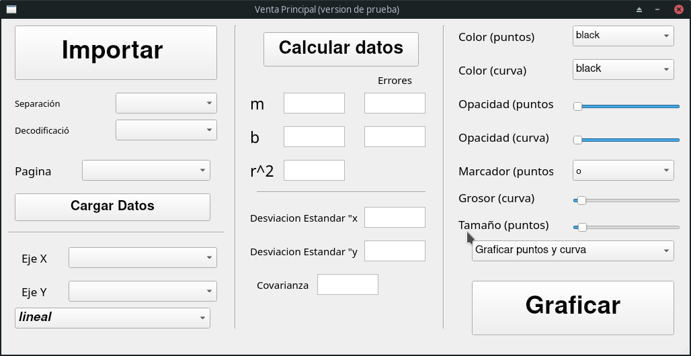
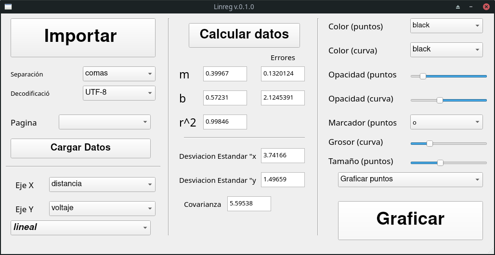

# Linreg
Un programa muy simple escrito en Python para realizar una regresión lineal a datos brindados por el usuario a travez de archivos de texto (.csv) o tablas de excel (.xlsx). 

No, la NASA no me ha financiado, por eso es que el código está muy mal optimizado, qué esperaban de 23 horas seguidas de desarrollo sin dormir y con la mayoría del código copiado de Dios sabe donde, en fin.




* [Requisitos](https://github.com/Fernando7299/Linreg#requisitos)
* [Cómo usar](https://github.com/Fernando7299/Linreg#c%C3%B3mo-usar)
* [Crea tu propio ejecutable](https://github.com/Fernando7299/Linreg#crea-tu-propio-ejecutable)
  * [Problemas comunes al crear el ejecutable](https://github.com/Fernando7299/Linreg#problemas-comunes-al-crear-un-ejecutable)
    * [tarda mucho tiempo en ejecutarse](https://github.com/Fernando7299/Linreg#tarda-mucho-tiempo-en-ejecutarse)
    * [Windows me salta una alerta de seguridad](https://github.com/Fernando7299/Linreg#tarda-mucho-tiempo-en-ejecutarse)
    * [El programa no se ejecuta después de compilar](https://github.com/Fernando7299/Linreg#el-programa-no-se-ejecuta-despu%C3%A9s-de-compilar)


## Requisitos
Puedes usar pip (pip3) o conda para su instalación.
- Matplotlib --> 3.0
- Numpy --> 1.16.1
- Pandas --> 1.1.0
- xlrd --> 1.2.0
- PyQt5 --> 5.15.0
## Cómo usar
Ejecutalo como cualquier script de Python
```bash
python main.py
```
En algunas distribuciones quizá debas usar
```bash
python3 main.py
```
La verdad, todo está en la pantalla, no creo que te pierdas.
En la carpeta "Archivos de prueba", hay nada más y nada menos que... archivos de prueba.

## Crea tu propio ejecutable
Debes tener instalado pyinstaller 
```bash
pip install pyinstaller
```
Clona este repositorio
```bash
git clone https://github.com/Fernando7299/BasicPyLinreg.git
```
Cambia a la carpeta donde tengas los archivos y crea el ejecutale:
```bash
cd BasicPyLinreg
pyinstaller -F main.py
```
Para tener una compilación más personalizada, revisa la [documentación](https://www.pyinstaller.org/documentation.html) de PyInstaller 

Para evitar errores al momento de momento de crear el ejecutable, es necesario que los requisitos estén en las versiones mencionadas anteriormente. Para instalar una versión específica de cada paquete, se pueden instalar de la siguiente manera:
```bash
pip install matplotlib==3.0
```
Y así con los demás paquetes

### Problemas comunes al crear un ejecutable
#### Tarda mucho tiempo en ejecutarse
Si ejecutas el siguiente comando para crear un ejecutable
```bash
pyinstaller --onefile main.py
```
El archivo que llega a salir tardará mucho tiempo en ejecutarse, recuerda que en ese archivo están todas las librerías

#### Windows me salta una alerta de seguridad
Como no tengo una firma registrada en Windows, es normal, además; tú mismo puedes revisar el código fuente para ver que nadie está robando tus datos. ¿Quién quiere tu historial de navegación del modo incognito?

#### El programa no se ejecuta después de compilar
Lo siento, para este tipo de problemas, deberías ir a la página de [PyInstaller](https://www.pyinstaller.org/)
